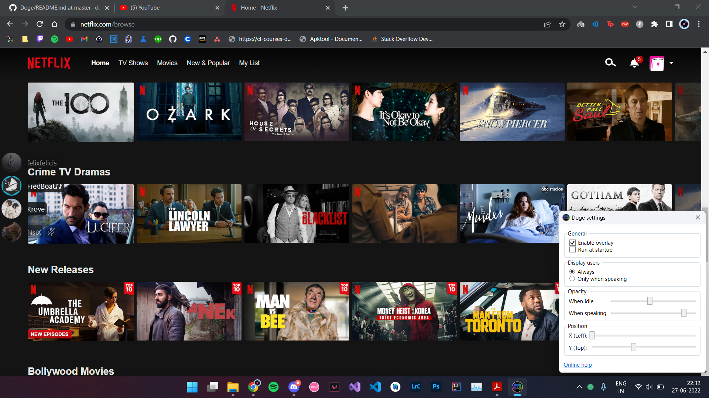

# Doge

A global overlay for Discord.

It's like the default Discord overlay, except that it's visible all the time, over any window (except games because you have the default overlay for that), and is also a bit more customizable.

## Download and Installation

Doge has been tested on 64-bit Windows 11, although it will work just fine on other versions (don't worry, this includes Windows 10). If, however, you find that it's not running properly on your device, you can always [ask for support](#contact-and-support).

Download files can be found in the [latest release here](https://github.com/dcdeepesh/Doge/releases/latest). Installation is a breeze.

> ℹ️ Your browser, OS, antivirus etc. may warn you that Doge and/or its setup are harmful. This is just because the files are unsigned, I assure you Doge doesn't do anything shady. If you're still unsure, you can have your developer friend check the source code :).

## Usage

- Using Doge is simple, just open it from its desktop shortcut or start menu entry, unless you've set it to [run at startup automatically](#run-at-startup), and you're good to go. Opening Doge will open the settings window by default, to assure you that it has started properly, as it takes a while to connect to your Discord client and display the overlay (this behaviour can be changed in the settings).
- The first time you open it, a flashy yellow box will remind you to connect Doge to Discord, as Doge can't access anything related to your Discord unless you allow it.
- You'll need to [whiltelist yourself](#whitelisting-yourself) before you can enjoy the convenience Doge provides.

### Run at startup

> ℹ️ This option isn't available yet.

By default, Doge does _not_ run at startup, because it's annoying to have apps automatically run at startup without you telling them to. However, it is highly recommended that you do so, as it saves you from the hassle of starting it every time you want to use it and improves user experience. To make Doge run at startup, enable the run at startup option in its settings.

However, whether or not you choose to enable it, you can always start it from its desktop shortcut or start menu entry.

## Whitelisting yourself

There's a small catch when using Doge. Because of how Discord's security features work, even if you connect Doge to your Discord client, it won't work until I whitelist you myself. Hopefully this will change in the future and manual whitelisting won't be necessary (I'm trying to achieve this).

Until then, drop a message in [this discussion](https://github.com/dcdeepesh/Doge/discussions/2), and unless I have an ongoing feud with you, you'll be whitelisted within a few minutes (unless I'm sleeping). Alternatively, if you don't have a GitHub account, you can contact me in other ways (see below), providing your Discord username and discriminator and requesting whitelisting.

## Contact and support

If you've found a bug, want to request a feature, request whitelisting, have a suggestion or have any other questions, you can contact me on Discord (`Krove#5477`), [email me](mailto:dcdeepesh7@gmail.com), or [open an issue](https://github.com/dcdeepesh/Doge/issues/new).
